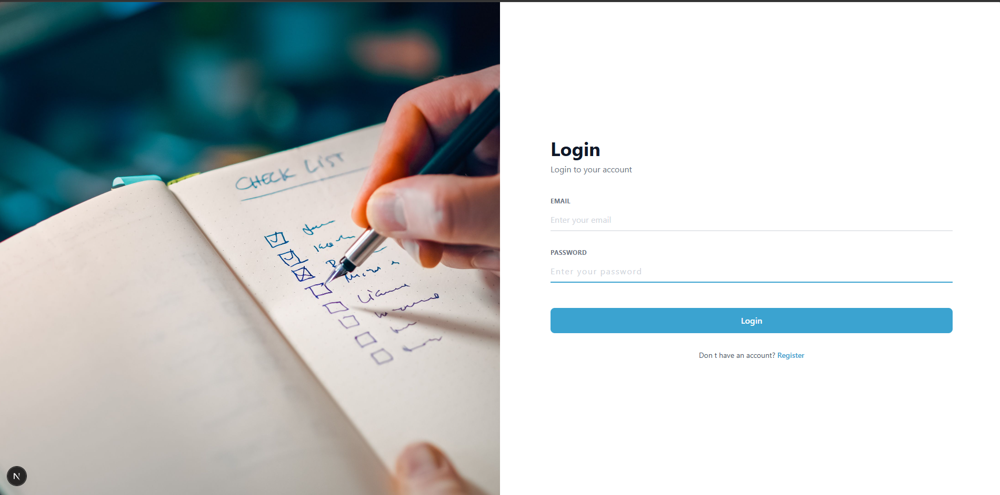
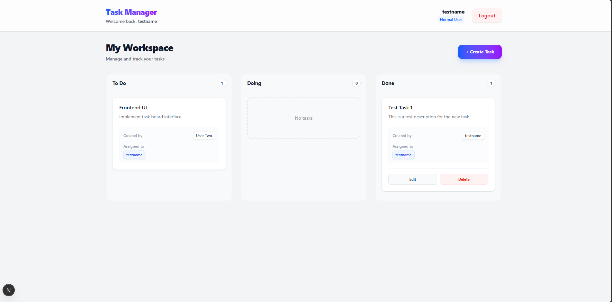

# LessTaxi Task Manager

## Project Overview

LessTaxi Task Manager is a full-stack web application designed to help teams and individuals efficiently manage, track, and assign tasks. It provides a beautiful and mobile-responsive dashboard to monitor tasks across different statuses, along with an administrative view to oversee system-wide users and their respective assignments.

## Technology Stack

The project is built using modern, robust web technologies:

- **Frontend:** [Next.js](https://nextjs.org/) (React Framework), Tailwind CSS (for styling and responsiveness)
- **Backend:** [Node.js](https://nodejs.org/) and [Express.js](https://expressjs.com/) (REST API)
- **Database:** [MongoDB](https://www.mongodb.com/) (NoSQL database for flexible data modeling)

## Application Screenshots

- **Login Page:**
  
- **Register Page:**
  
- **Dashboard View:**
  

## Environment Variables

To run this project, you will need to add the following environment variables to your `.env` files. 

### Backend Environment Variables (`backend/.env`)

Create a `.env` file in the root of the `backend` directory and configure the following variables (make sure to replace the placeholder values with your actual configuration):

```env
# The port on which the backend server will run
PORT=5000

# Your MongoDB connection string
MONGO_URI=mongodb+srv://<username>:<password>@cluster0.ugpprvh.mongodb.net/<dbname>?appName=Cluster0

# Secret key for signing JSON Web Tokens (JWT)
JWT_SECRET=your_jwt_secret_key
```

*(Note: Depending on your frontend configuration, you might also need an `.env.local` file in the `frontend` folder containing your API URL, such as `NEXT_PUBLIC_API_URL=http://localhost:5000/api`)*

## Setup Instructions

Follow the steps below to run the application locally.

### 1. Backend Setup

1. Open a terminal and navigate to the `backend` directory:
   ```bash
   cd backend
   ```
2. Install the backend dependencies:
   ```bash
   npm install
   ```
3. Create the `.env` file and add the required environment variables as shown above.
4. Start the backend development server:
   ```bash
   npm run dev
   # or
   npm start
   ```
   The backend server should now be running on `http://localhost:5000`.

### 2. Frontend Setup

1. Open a new terminal window/tab and navigate to the `frontend` directory:
   ```bash
   cd frontend
   ```
2. Install the frontend dependencies:
   ```bash
   npm install
   ```
3. Start the frontend development server:
   ```bash
   npm run dev
   ```
   The frontend application should now be accessible at `http://localhost:3000`.

## Deployment Information

This application is currently deployed using **AWS EC2** with domain management handled via **GoDaddy**.

- **Infrastructure:** Hosted on an AWS EC2 instance. Ensure that necessary security groups are configured to allow incoming HTTP/HTTPS traffic.
- **Domain & DNS:** The custom domain is registered and managed through GoDaddy, with DNS records pointing to the AWS EC2 instance's public IP address.
- **Database:** Uses MongoDB Atlas for a scalable cloud database solution. Make sure to whitelist your AWS EC2 instance's IP address in the MongoDB Atlas network access settings.

### Alternative Deployment Options

If you wish to deploy the frontend and backend separately on specialized hosting platforms, consider the following options:

- **Backend:** The Node.js/Express API can be deployed to Platform-as-a-Service (PaaS) providers such as [Render](https://render.com/), [Heroku](https://www.heroku.com/), or [DigitalOcean App Platform](https://www.digitalocean.com/products/app-platform). Make sure to configure the required environment variables in your chosen provider's dashboard.
- **Frontend:** The Next.js frontend is optimized for deployment on Serverless/Edge networks like [Vercel](https://vercel.com/) (recommended for Next.js) or [Netlify](https://www.netlify.com/). These platforms automatically detect Next.js and configure the correct build settings.
